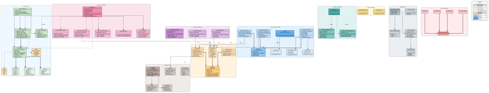

# Diagram Generator MCP Server

Generate UML and architecture diagrams from Python codebases using tree-sitter parsing or LLM-driven intelligent analysis.



## Features

- **UML Class Diagrams**: Classes, methods, attributes, inheritance, enums
- **Component Diagrams**: Module structure and dependencies
- **Fast Mode**: Tree-sitter parsing (2-5 seconds)
- **LLM Mode**: Context-aware custom diagrams (10-30 seconds)
- **Flexible Layouts**: Horizontal (LR) or vertical (TB)
- **Auto Output**: Creates `arch/diagrams/` with `.dot` and `.png` files

## Installation

### Prerequisites

```bash
# macOS
brew install graphviz

# Ubuntu/Debian
sudo apt-get install graphviz
```

### Install Server

```bash
cd diagram-generator
uv pip install -e .
```

### Configure Claude Desktop

Add to `~/Library/Application Support/Claude/claude_desktop_config.json`:

```json
{
  "mcpServers": {
    "diagram-generator": {
      "command": "uv",
      "args": [
        "--directory",
        "/path/to/diagram-generator",
        "run",
        "diagram-generator"
      ]
    }
  }
}
```

Restart Claude Desktop.

## Usage

### Fast Mode

```
Generate UML and component diagrams for /path/to/my/project
```

Uses `generate_uml_diagram` and `generate_component_diagram` tools for quick, standard diagrams.

### LLM Mode

```
Analyze my project and create a diagram focusing on the authentication system at /path/to/my/project
```

Uses `analyze_codebase_structure` + `render_diagram_from_dot` for intelligent, custom diagrams.

## Available Tools

### 1. `generate_uml_diagram`
- **Input**: Path to directory/file, layout (LR/TB)
- **Output**: `arch/diagrams/class_diagram.png`
- **Features**: All classes, inheritance, methods, attributes

### 2. `generate_component_diagram`
- **Input**: Path to directory
- **Output**: `arch/diagrams/component_diagram.png`
- **Features**: Modules, dependencies, architecture layers

### 3. `analyze_codebase_structure`
- **Input**: Path to directory
- **Output**: JSON with classes, methods, imports, structure
- **Use**: LLM analyzes and decides what to visualize

### 4. `render_diagram_from_dot`
- **Input**: DOT specification, output path, filename
- **Output**: Custom `.dot` and `.png` files
- **Use**: Render LLM-generated diagrams

## When to Use Each Mode

**Fast Mode**: Complete documentation, standard diagrams, reproducible output

**LLM Mode**: Custom views (auth flow, data layer), intelligent grouping, focused diagrams, pattern detection

## Examples

**Quick diagrams:**
```
Generate diagrams for /Users/me/myproject/src
```

**Custom authentication diagram:**
```
Show me the authentication and authorization flow in /Users/me/myproject/src
```

**Multi-level views:**
```
Create high-level and detailed data layer diagrams for /Users/me/api-project
```

## Output Structure

```
your-project/
├── arch/
│   └── diagrams/
│       ├── class_diagram.dot
│       ├── class_diagram.png
│       ├── component_diagram.dot
│       └── component_diagram.png
└── (your source code)
```

## Development

### Running Tests

```bash
uv run pytest tests/
uv run pytest -v tests/
```

### Running Server

```bash
uv run diagram-generator
# or
uv run python -m diagram_server
```

## Troubleshooting

**"Graphviz executable not found"** - Install graphviz system package

**"No classes found"** - Ensure path contains `.py` files with classes and use absolute paths

**Diagrams not appearing** - Check MCP config, restart Claude Desktop, verify absolute paths

## Technical Details

**Technologies**: Tree-sitter, Graphviz, FastMCP, Python 3.10+

**Supported**: Classes, inheritance, methods, attributes, enums, type annotations, imports

**Limitations**: Python-only, partial type annotation extraction

## License

MIT

## Credits

Built with [MCP](https://modelcontextprotocol.io/), [tree-sitter](https://tree-sitter.github.io/tree-sitter/), [Graphviz](https://graphviz.org/), [FastMCP](https://github.com/jlowin/fastmcp)
